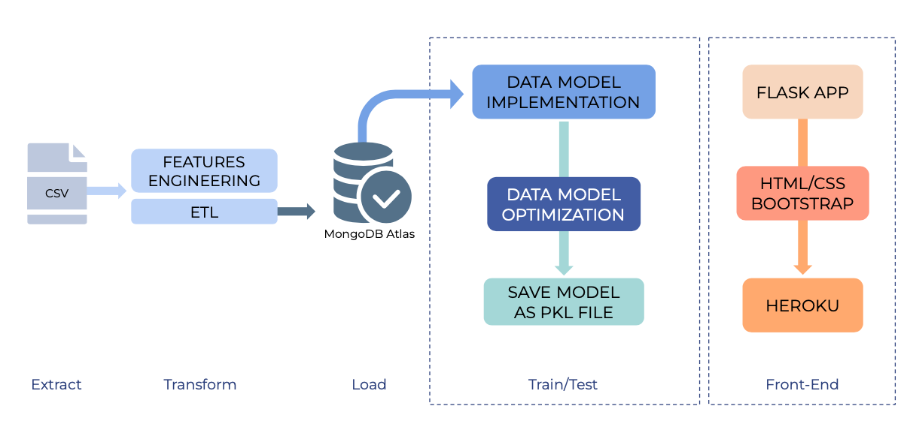
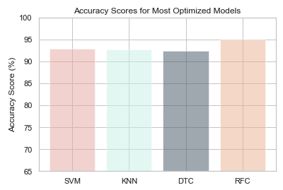

# Machine Learning: Stroke Prediction Model
Please refer to the [report](pdf link), [presentation](pdf link) and [model optimization tracker](https://github.com/hiamdebsi/ML-Stroke-Prediction/blob/main/Model_Optimization_Tracker.pdf) for a thorough explanation of this project.

[Github Link of Flask App](https://github.com/SherryKennedy/Stroke_Prediction_Model)                         
[Heroku Link](https://stroke-predictor.herokuapp.com/)                      
[Github Link to Model Code](https://github.com/hiamdebsi/ML-Stroke-Prediction)

## Motivation
Annually, 15 million people worldwide suffer a stroke. Of these, 5 million die and another 5 million are left permanently disabled, placing a burden on family and community.(1) A stroke occurs when blood supply to parts of the brain is interrupted or reduced, which prevents brain tissue from getting it’s needed nutrients. This begins to deteriorate brain cells within minutes. Strokes are the leading cause of long-term disability and carry a very high risk of death(2). It is commonly seen amongst those with high blood pressure, diabetes, obesity, and smokers of age 40 years and above mostly.(2) Are you at a high risk of developing a stroke? Let’s find out!

## Abstract
For this project, we used a csv file of 5110 patient data from Kaggle. The data was explored and manipulated using Pandas in order to populate a clean dataset. Once transformed and saved, the data was loaded onto MongoDB Atlas in the cloud. We further queried data in order to prepare it for model implementation and we used a variety of Sklearn libraries to test various models and optimize them to the best of our abilities.Given that the data we were working on was pre-labelled, we explored supervised classification machine learning. 

Based on the models we compiled, the highest accuracy was achieved with the Random Forest Classifier. By using the optimization methods of SMOTE(oversampling), balancing and setting the following parameters: max_depth=50, max_features=5, min_sample_leaf=3, min_samples_split=8, n_estimators=200, the accuracy reached 95%. Based on the trained model, we created an app built with this model to give predictions based on the user's input information. 

## Project Objective
By training the dataset with the appropriate models and stating their comparisons, the most optimized model will be chosen in order to predict stroke risk with the best accuracy test score. In addition, we will connect the model to a front end flask application which will predict whether the user is at risk or not at risk to develop a stroke. 

## Methods
### Data Sources Used:
  * [Kaggle Stroke Prediction Dataset](https://www.kaggle.com/fedesoriano/stroke-prediction-dataset)

### Final Production Database: 
 * MongoDB Atlas

### Libraries Used: 
  * Matplotlib.pyplot
  * Pandas
  * Seaborn
  * Pymongo
  * Sklearn
  * Pickle

## [Data Engineering](https://github.com/hiamdebsi/ML-Stroke-Prediction/tree/main/Data%20Engineering)

* Link jupyter notebook * 

## Model Data [Implementation and Optimization](https://github.com/hiamdebsi/ML-Stroke-Prediction/blob/main/Data%20Model%20Implementation/Final_Optimized_Model_RM-Copy1.ipynb) 

 * Evaluated 4 models: Support Vector Machine (SVM), K-Nearest Neighbor(KNN),Decision Tree Classifier, and Random Forest Classifier.
 * Used the following [optimization methods](link to report) to improve models:
   * SMOTE
   * GridSearchCV Optimizer
   * Scaled Data
   * Stratifying Data
* We then saved the final optimized model as a pkl file in order to deploy on Heroku. Details of the Flask Application as well as the Heroku Deployment will be [linked right here.](https://github.com/SherryKennedy/Stroke_Prediction_Model)

## Conclusions

As seen in the visual above, after optimization procedures, all models accuracy reached above 90%. The Random Forest Classification Model was the most accurate algorithm after optimization with a 95% accuracy score. We considered it as the “best choice’’ so far based on several considerations: Higher accuracy score, better performance on recall score and individual features of input information.

## References

Data set Link: https://www.kaggle.com/fedesoriano/stroke-prediction-dataset
1. http://www.emro.who.int/health-topics/stroke-cerebrovascular-accident/index.html
2. https://www.cdc.gov/stroke/about.htm
3. https://avinetworks.com/glossary/anomaly-detection/
4. https://scikit-learn.org/stable/supervised_learning.html#supervised-learning
5. https://towardsdatascience.com/gridsearchcv-for-beginners-db48a90114ee
6. https://machinelearningmastery.com/smote-oversampling-for-imbalanced-classification/
7. https://scikit-learn.org/stable/supervised_learning.html
8. https://realpython.com/flask-by-example-part-1-project-setup/

